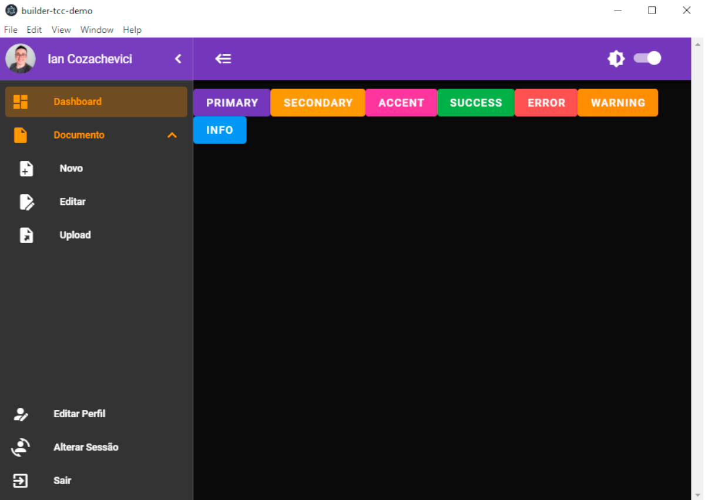
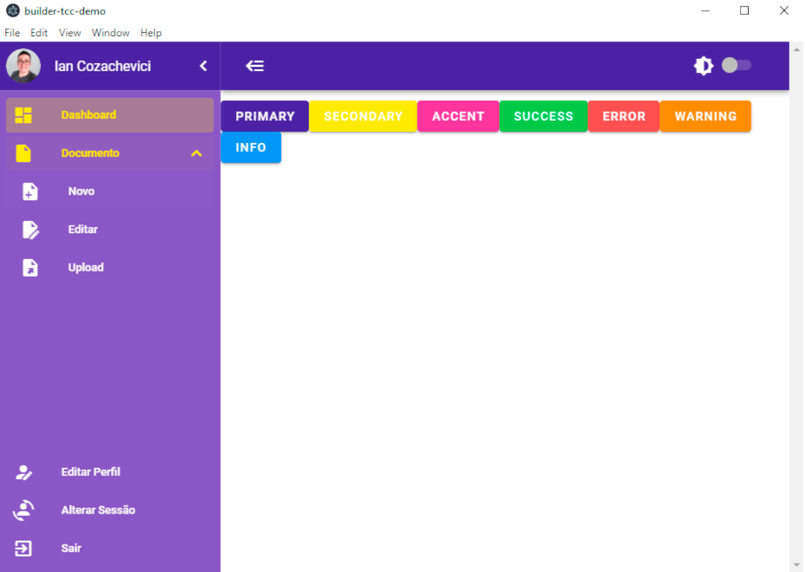
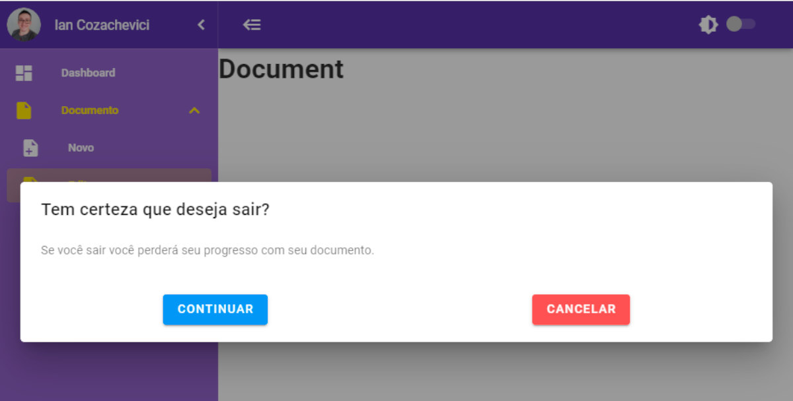
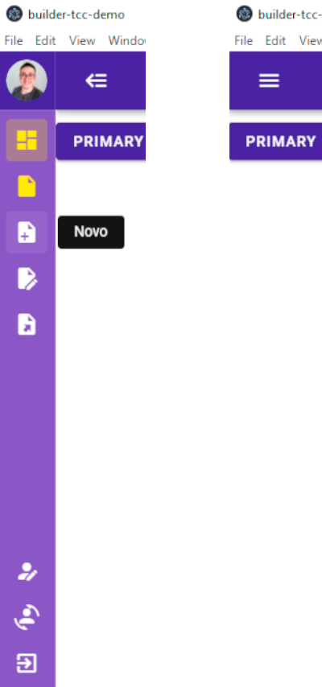
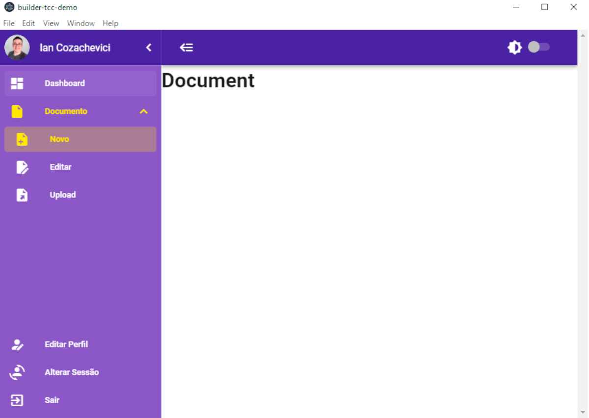
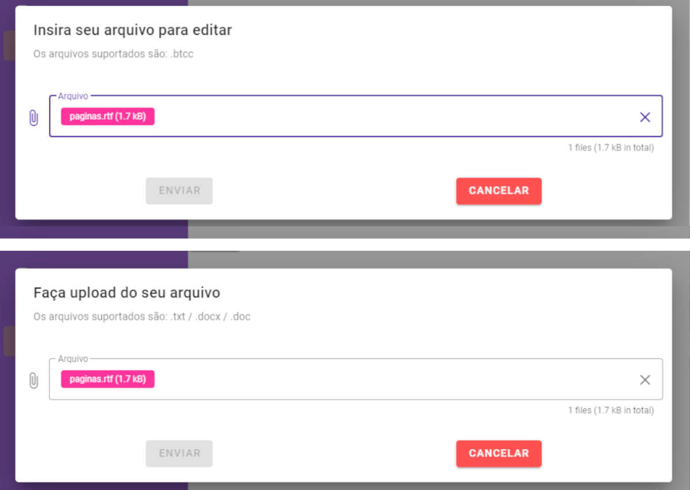
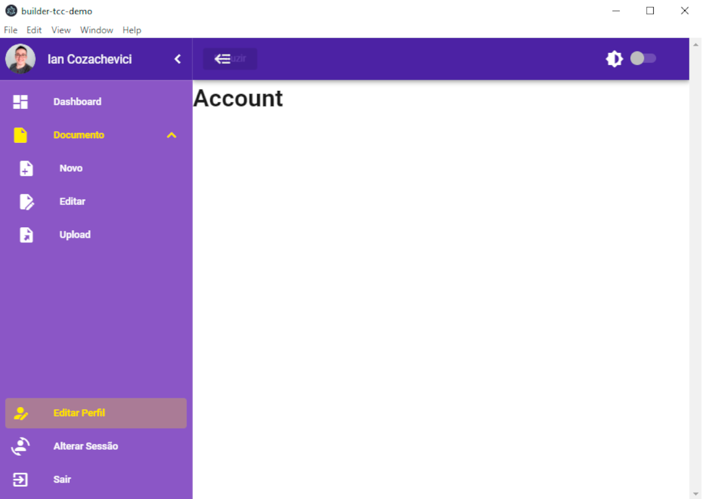

<h1 align="center">
    
</h1>

<h4 align="center"> 
	🚧 Builder TCC 🚀 em construção... 🚧
</h4>


## 💻 Sobre o projeto

📝 Builder TCC - é uma plataforma criada principalmente para estudantes que estão desenvolvendo seus trabalhos de conclusão de curso. No Builder TCC é possível tranformar um texto comum em um texto com todas as formatações exigidas pela ABNT.


## 🎨 Layout

### Dashboard

A dashboard é a página inicial que o usuário acessa, ela possui tema claro, escuro e outras features:

| **Tema Escuro** | **Tema Claro** |
|-----------------|----------------|
|  |  |

| **Modal de confirmação de ação:** |
|-----------------|
|Para evitar que o usuário cometa erros e acabe perdendo o documento em progresso, é apresentado um modal com uma mensagem para confirmar a ação do usuário, por exemplo: se o usuário está com um documento aberto e tenta acessar as funcionalidade **Editar** ou **Upload**, a mensagem é apresentada aguardando a confirmação do usuário |
| <p align="center"></p> |

	
|                                                    **Ocultar/Mostrar:**                                                 |
|:-----------------------------------------------------------------------------------------------------------------------:|
|                       A sidebar pode ser expandida ou ocultada através dos ícones mostrados abaixo                      |
|  	|


### Funcionalidades
Os usuários terão acesso a dashboard onde terão as seguinte opções:
- **Novo:** Exibe um espaço em branco onde será possível mexer no documento adicionando texto


- **Editar:** Apresenta um modal para carregamento de um arquivo com a extensão específica do Builder TCC
- **Upload:** Apresenta um modal para carregamento de um arquivo com qualquer extensão de texto


- **Editar Perfil:** Exibe as informações do usuário e os campos editáveis para atualização dos dados cadastrais.



## 🛠 Tecnologias

As seguintes ferramentas foram usadas na construção do projeto:

- [Expo][expo]
- [Node.js][nodejs]
- [React][reactjs]
- [React Native][rn]
- [TypeScript][typescript]


## 🚀 Como executar o projeto

Podemos considerar este projeto como sendo divido em três partes:
1. Back End (pasta server) 
2. Front End (pasta web)
3. Mobile (pasta mobile)

💡Tanto o Front End quanto o Mobile precisam que o Back End esteja sendo executado para funcionar.

### Pré-requisitos

Antes de começar, você vai precisar ter instalado em sua máquina as seguintes ferramentas:
[Git](https://git-scm.com), [Node.js][nodejs]. 
Além disto é bom ter um editor para trabalhar com o código como [VSCode][vscode]

### 🎲 Rodando o Back End (servidor)

```bash
# Clone este repositório
$ git clone https://github.com/tgmarinho/nlw1

# Acesse a pasta do projeto no terminal/cmd
$ cd nlw1

# Vá para a pasta server
$ cd server

# Instale as dependências
$ npm install

# Execute a aplicação em modo de desenvolvimento
$ npm run dev:server

# O servidor inciará na porta:3333 - acesse http://localhost:3333 
```

### 🧭 Rodando a aplicação web (Front End)

```bash
# Clone este repositório
$ git clone https://github.com/tgmarinho/nlw1

# Acesse a pasta do projeto no seu terminal/cmd
$ cd nlw1

# Vá para a pasta da aplicação Front End
$ cd web

# Instale as dependências
$ npm install

# Execute a aplicação em modo de desenvolvimento
$ npm run start

# A aplicação será aberta na porta:3000 - acesse http://localhost:3000
```

### 📱Rodando a aplicação mobile 

🚧 Em construção... 🚧

## 😯 Como contribuir para o projeto

1. Faça um **fork** do projeto.
2. Crie uma nova branch com as suas alterações: `git checkout -b my-feature`
3. Salve as alterações e crie uma mensagem de commit contando o que você fez: `git commit -m "feature: My new feature"`
4. Envie as suas alterações: `git push origin my-feature`
> Caso tenha alguma dúvida confira este [guia de como contribuir no GitHub](https://github.com/firstcontributions/first-contributions)


## 📝 Licença

Este projeto esta sobe a licença MIT.

Feito com ❤️ por Thiago Marinho 👋🏽 [Entre em contato!](https://www.linkedin.com/in/tgmarinho/)

[nodejs]: https://nodejs.org/
[typescript]: https://www.typescriptlang.org/
[expo]: https://expo.io/
[reactjs]: https://reactjs.org
[rn]: https://facebook.github.io/react-native/
[yarn]: https://yarnpkg.com/
[vscode]: https://code.visualstudio.com/
[vceditconfig]: https://marketplace.visualstudio.com/items?itemName=EditorConfig.EditorConfig
[license]: https://opensource.org/licenses/MIT
[vceslint]: https://marketplace.visualstudio.com/items?itemName=dbaeumer.vscode-eslint
[prettier]: https://marketplace.visualstudio.com/items?itemName=esbenp.prettier-vscode
[rs]: https://rocketseat.com.br
