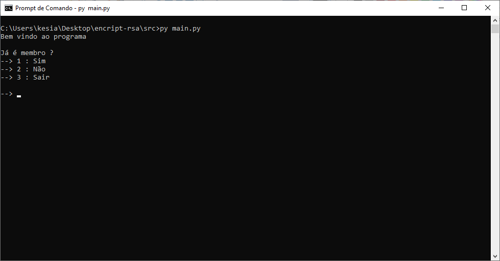
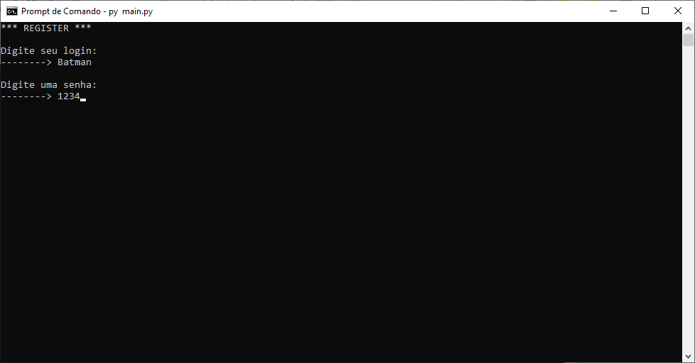
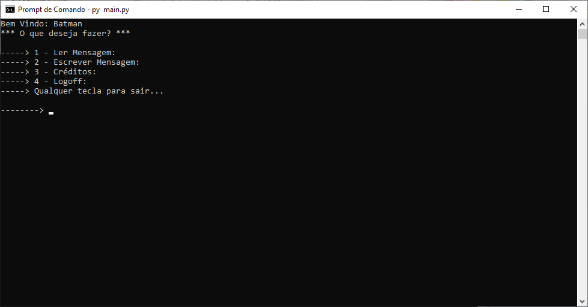
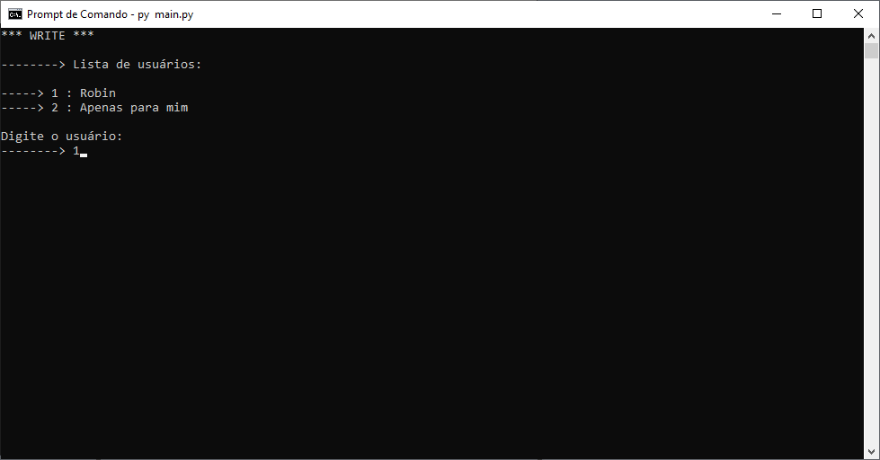
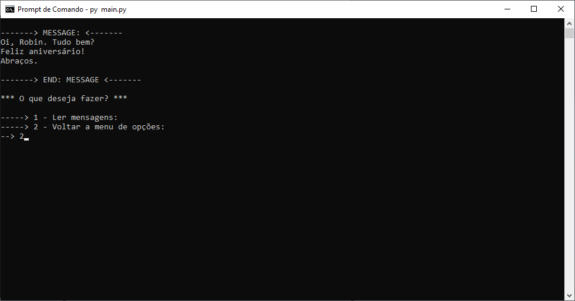
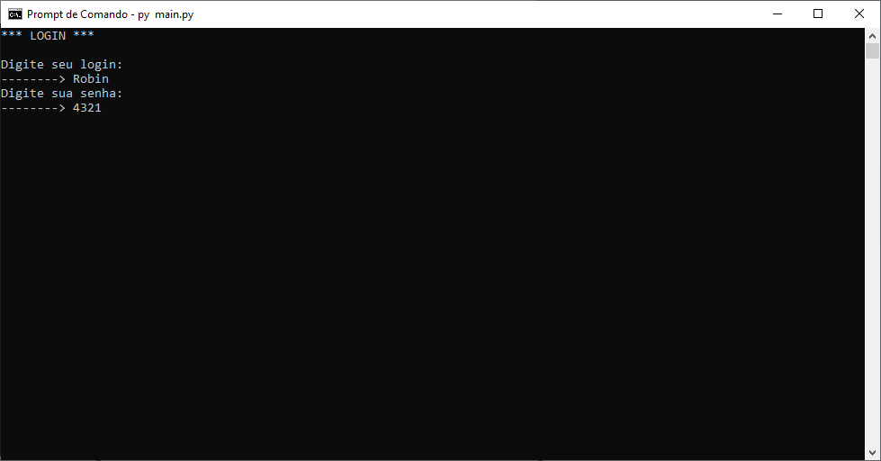
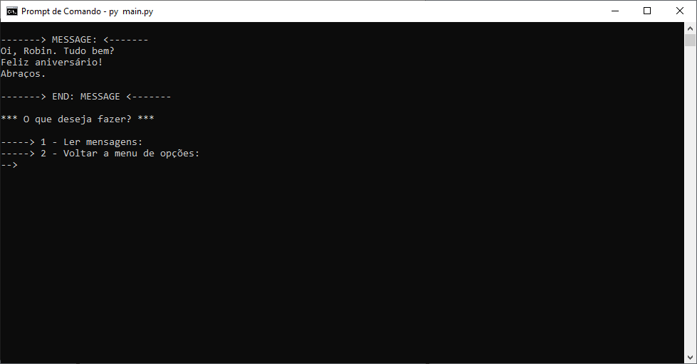
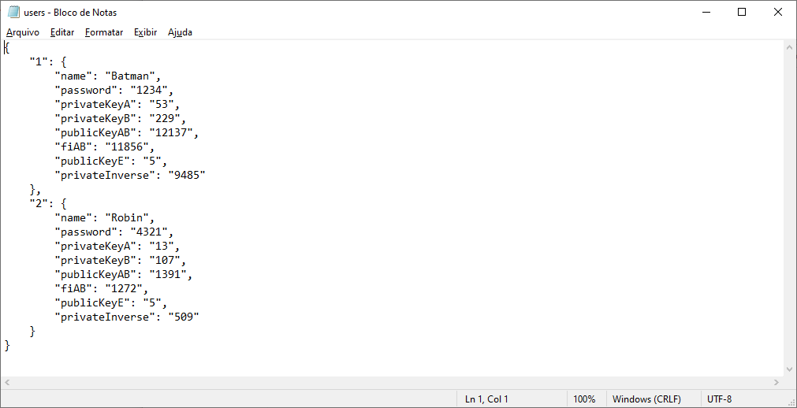
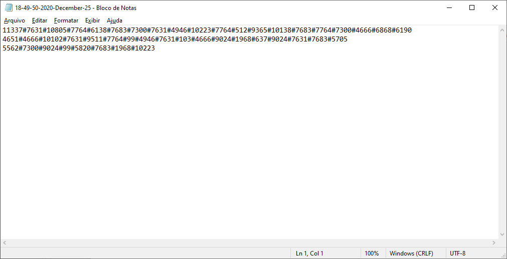

<h4 align="center"> 
	 Criptografia RSA 🚀
</h4>


## 💻 Sobre o projeto

🔐 Criptografia RSA - Trabalho de conclusão do segundo semestre da faculdade. A criptografia RSA é uma forma de criptografia muito conhecida que permite a transmissão segura de dados. Neste projeto de criptografia que desenvolvi, o sistema encripta a chave pública, ao mesmo tempo que gera a chave de decriptação, que é secreta (chave privada).

## :heavy_exclamation_mark: Entendendo o projeto

Abaixo temos uma tabela com algumas ações possíveis no sistema: 

| Funcionalidade              	| Ações possíveis                                                                                                                                	| Imagem          	|
|-----------------------------	|------------------------------------------------------------------------------------------------------------------------------------------------	|-----------------	|
|   Tela inicial do programa  	| Realizar login ou criar um novo registro                                                                                                       	|  	|
| Criar um novo registro      	| Informar um login e uma senha para criação do novo registro                                                                                    	|  	|
| Usuário logado              	| 1. Ler mensagem recebida ou enviada (decriptada)<br>2. Escrever mensagem para um usuário<br>3. Ver os créditos do programa<br>4. Fazer logoff  	|  	|
| Escrever mensagem 1         	| Escolher um usuário para enviar a mensagem                                                                                                     	|  	|
| Escrever mensagem 2         	| Escrever a mensagem a ser enviada                                                                                                              	|  	|
| Ler mensagem 1              	| Selecionar uma mensagem a ser lida                                                                                                             	|  	|
| Ler mensagem 2              	| Ler a mensagem enviada para outro usuário (decriptada)                                                                                         	|  	|
| Logoff                      	| Usuário é retornado para Tela inicial do programa                                                                                              	|  	|
| Fazer login                 	| Informar o login e a senha do usuário que recebeu a mensagem                                                                                   	|  	|
| Ler mensagem 1              	| Selecionar uma mensagem a ser lida                                                                                                             	|  	|
| Ler mensagem 2              	| Ler a mensagem recebida por outro usuário (decriptada)                                                                                         	|  	|
| Pasta src/banco             	| Abrir arquivo users.txt<br>Todos usuários criados são apresentados                                                                             	|  	|
| Pasta src/msgs/Nome-Usuário 	| Abrir arquivo .txt<br>A mensagem é exibida encriptada                                                                                          	|  	|

## 🛠 Tecnologias

As seguintes ferramentas foram usadas na construção do projeto:

- Linguagem
	- [Python](https://www.python.org/) (estruturado)
- Bibliotecas
	- [Random](https://docs.python.org/3/library/random.html)
	- [Math](https://docs.python.org/3/library/math.html)
	- [Datetime](https://docs.python.org/3/library/datetime.html)
	- [Sys](https://docs.python.org/3/library/sys.html)
	- [os](https://docs.python.org/3/library/os.html)
	- [Shutil](https://docs.python.org/3/library/shutil.html)
	- [Getpass](https://docs.python.org/pt-br/3/library/getpass.html)
	- [Platform](https://docs.python.org/pt-br/3/library/platform.html)
	- [JSON](https://docs.python.org/3/library/json.html)


## 🚀 Como executar o projeto

### Pré-requisitos

Antes de começar, é  importante você ter previamente instalado em seu computador o [Git](https://git-scm.com) e o [Python](https://www.python.org/).

### ⏳ Rodando a aplicação

```bash
# Clone este repositório
$ git clone https://github.com/iam-ianc/encript-rsa

# Acesse a pasta src do projeto no terminal/cmd
$ cd encript-rsa/src

# Execute a aplicação
$ py main.py

```
